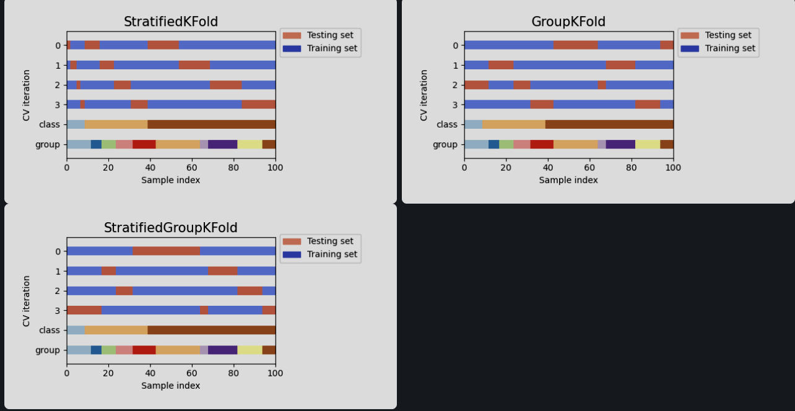
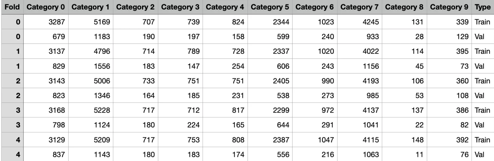
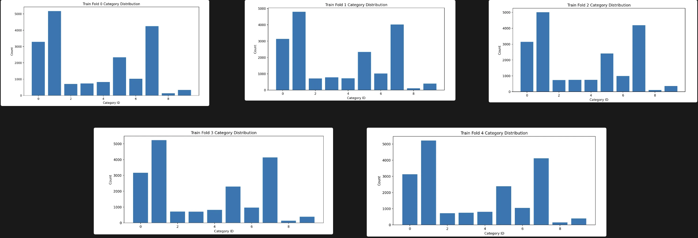

# KFold
> 모든 데이터를 Train, Val 에 사용할수 있도록 하는 Method 입니다.

# StratifiledKFold
> 모든 데이터를 랜덤으로 나누는 KFold에서 각 Fold 별 클래스 분포를 균등하게 나누기 위해 도입된 Method 입니다. 주로 classifidation 과 같이 하나의 데이터에 대해 하나의 class를 갖는 경우 사용할수 있는 Method 입니다.

# GroupFold
> Object Detection, Segmentation 처럼 하나의 이미지안에 여러 객체가 존재하는 경우 KFold를 적용하기 위한 Method입니다. group의 개념이 들어가 주로 같은 이미지 내의 모든 객체가 하나의 fold에 들어가 도록 해줍니다.

# StratifiedGroupKFold
> StratifiedKFold + GoupFOld로 하나의 데이터에 여러 객체(클래스) 가 존재하는 경우 클래스의 불균형을 막으면서 Group을 기준으로 KFold를 진행하는 Method 입니다.

### <Object Detection Task에서 StratifiedGroupKFold 적용한 결과 >

[Reference](https://scikit-learn.org/dev/auto_examples/model_selection/plot_cv_indices.html#sphx-glr-auto-examples-model-selection-plot-cv-indices-py)