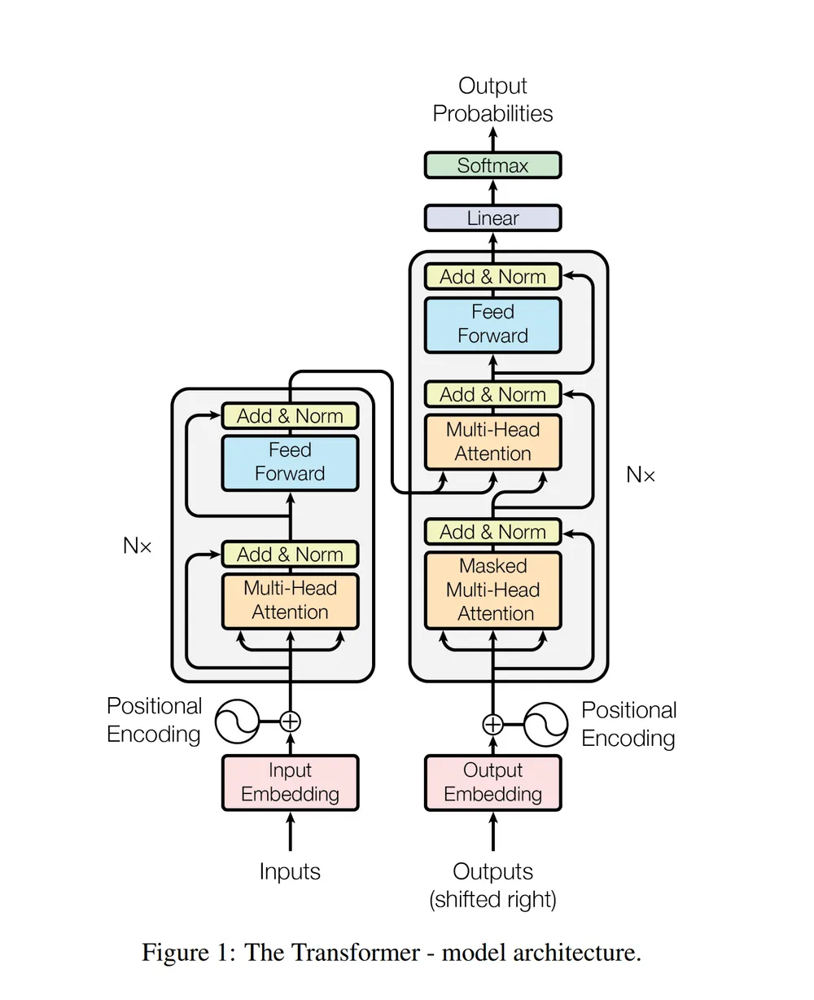
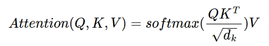
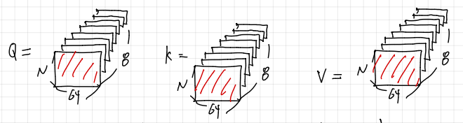
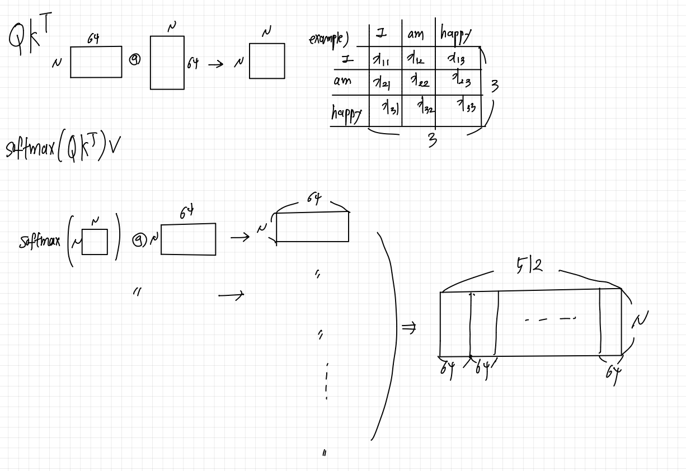

# Attention Is All You Need

> 해당 논문에서는 최초로 Self Attention 구조만을 사용하여 기계번역을 구현하였습니다. RNN 구조를 갖고 있지 않기 때문에 거리가 먼 x에 대해서도 모두 동일한 연산량으로 계산할 수 있어 계산의 효율성을 높히면서도 높은 성능을 보여주었습니다.

## Transformer의 구조

## Transformer 구조 설명

Transformer는 크게 Encoder Decoder 구조로 구성되어있습니다. 

> Encoder

#### [ Input Data ]
Encoder에서는 우선 데이터를 Embedding하게 됩니다.

예를들어 입력 데이터가 "I am happy " 라는 입력이 들어오면 Encoder에서 해당 데이터를 우선 **Token 단위** 로 데이터를 분할하게 됩니다. 예를 들어서 단어 단위로 Token을 분할하게 되면  Token = ['I', 'am', 'happy'] 이 됩니다.

이후 각 Token들에 대해서 특정 차원 D_model 으로 임베딩 하게 됩니다.
예를들어 D_model = 3 인경우 
Token = [[1, 0, 0], [0, 1, 0], [0, 0, 1]] 이런식으로 Embedding이 되게 됩니다.
해당 논문에서는 D_model = 512로 임베딩하였다고 합니다.

그렇다면 Token의 수가 N 개이고 D_model = 512 로 입력 데이터를 임베딩 하는경우 N * 512 크기의 Matrix를 얻게 됩니다. 이것이 바로 Transformer의 Input 데이터가 됩니다.

하지만 Sequence 데이터에서 " 내가 너를 때린다 " VS "너가 나를 떄린다 " 처럼 각 단어의 순서가 중요한 경우가 존재합니다. 그렇기에 각 데이터의 순서에 대한 정보를 입력해줄 필요가 있습니다.

그래서 해당 논문에서는 Positional Encoding값을 더해줌으로써 각 Token의 위치 정보를 추가해주게 됩니다. 이때 Positional Encoding 값 또한 N * 512 크기가 됩니다. 

결국 Token Embedding = T, Positional Encoding = P 라고 하였을때 둘다 N * 512 크기를 갖게 되므로 단순히 T + P 계산을 통해서 하나의 Matrix를 만들게 됩니다.

#### [ Attention ]
위에서 만든 N * 512 크기의 행렬을 Input이 Encoder의 Attention Module에 들어가게 됩니다.

Attention 구조에서는 데이터를 Q, K, V 행렬로 분할하여 계산하게 됩니다.

위의 수식과 같이 Attention이 계산되는데, 이때 필요한 것이 바로 Q, K, V 값입니다. 이 값을 만들기 위해서 W_iq, W_ik, W_iv 라는 가중치 행렬을 두게 됩니다.

(**해당 설명에서는 Multi Head의 개념으로 설명하겠습니다, Multihead를 사용하는 이유는 서로다른 가중치를 사용함으로써 보다 다양한 Insight를 얻을수 있기 때문입니다.**)

Multi Head = 8인경우 보통 dim = d_model / head 로 결정되기 때문에 예시에서는 dim = 512/ 8 = 64 차원으로 가중치 행렬의 차원을 결정하겠습니다.

즉, Q를 만들기 위한 W_iq의 경우 W_1q, W_2q ..... W8_q 까지 8개의 가중치가 필요하며 최종적으로 Q,K,V를 위해서는 24개의 행렬의 필요하게 됩니다. 각 행렬의 크기는 [512 * 64]가 됩니다.

아무튼, 각 행렬을 Encoder의 Input과 행렬곱을 하게 됩니다. 그러면 [ N * 512 ] @ [ 512 * 64 ] 를 통해서 최종적으로 [ N * 64 ] 크기의 Q, K, V가 각각 8개씩 만들어 지게 됩니다.

최종적으로 정리해보면 다음과 같이 각 8개씩 [ N * 64 ] 크기의 Q, K, V가 생성되게 됩니다. 그리고 이해를 돕기 위해서 가장 앞에 있는 Q, K, V 만을 사용해서 설명해보도록 하겠습니다. ( 어차피 모두 동일하게 작동하기에 마지막에 concat하면 되기에 )

이제 Q, K, V에 대해 구했으니 위의 공식에 맞게 계산을 하게 됩니다. 가장 먼저 Q @ K.T를 진행하게 됩니다. 이를 통해서 [ N * 64] @ [ 64 * N ] = [ N * N ]의 행렬을 얻게 되는데, 해당 행렬이 의미하는것은 각 토큰들 끼리의 유사도(연관성) 을 나타내게 됩니다. 위에서 들었던 예시를 생각해보면 3 * 3에서 각 I 와 am, happy의 유사도를 구하게 된다고 생각하면 됩니다.

그리고 dim이 크게 되면 자연스럽게 값이 너무 커지기 때문에 sqrt(D_model) 값으로 나눠주어 너무 큰 값이 되지 않도록 정규화를 진행해 줍니다.

그리고 softmax()를 진행하여 상대적인 유사도를 파악하게 됩니다. 이렇게 되면 서로 연관성이 높은 토큰들의 값이 높고, 그렇지 않으면 작은 값을 갖게 됩니다. 

이후 각 토큰의 정보인 V에 곱해 줌으로써, 각 토큰 정보에 **가중치**를 부여하여 더 중요한 토큰의 정보가 반영되고 덜 중요한 단어는 영향을 덜 받게 됩니다.

이러한 계산을 통해서 서로 연관성이 높은 토큰들에 대해서는 높은 가중치를 갖게되며, 관련성이 없는 토큰들에 대해서는 낮은 가중치를 갖게됩니다.

이를 행렬의 관점에서 바라보게 되면 다음과 같습니다.

    softmax([N * 64] @ [ N * 64]) @ [N * 64] => [ N * 64 ] 

즉, Attention input과 output은 동일한 크기를 갖게 됩니다.  우리가 MultiHead를 사용하였기에 각 Q,K,V가 64차원으로 8개씩 추가적으로 있기에 이를 모두  concat 시킨다면 결국 N * 512 크기의 행렬을 얻게 됩니다. 

즉, Attention의 input과 output의 크기가 동일하기 떄문에 해당 논문에서는 Attention 구조를 총 6개 쌓아올리는 구조를 만들수 있었습니다.

그리고 아래와 같은 구조를 총 6번을 진행하게 됩니다. FFN의 경우 행렬에 비선형성을 추가해주는 역할을 하고 Norm & ADD애서 정규화 및 skip connection을 하게 됩니다.
        
    Multi_Head Attention -> Norm & ADD -> FFN -> Norm & ADD

